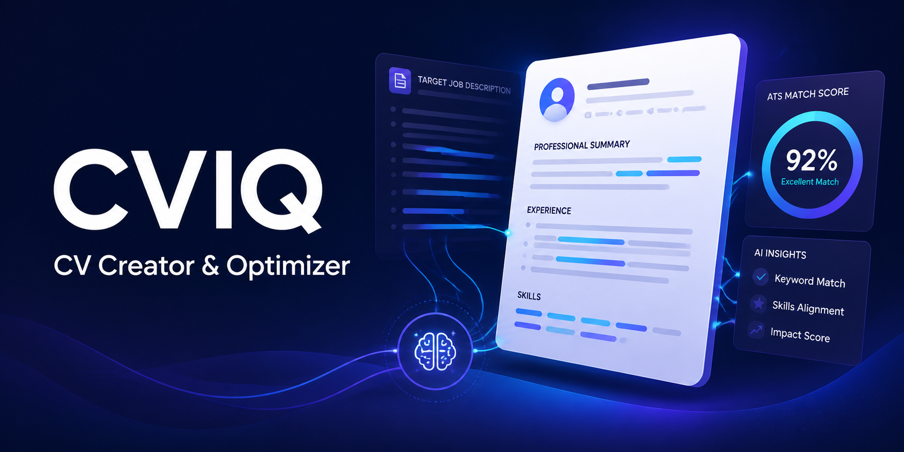

# CVIQ

*CV Creator & Optimizer* — a single-user web app to **create** an ATS-friendly CV from scratch or **optimize**
an existing one against a target Job Description (JD), powered by a large language
model (LLM). Final output exports to **PDF** and **Word (.docx)**.

- Build a CV by picking one of **8 template designs** (gallery of dummy-data PDFs) or a
  **Blank/Simple** built-in design, and filling it in with AI-assist.
- Upload an existing PDF/DOCX CV and have it parsed into a canonical, editable
  structure; accept AI suggestions, then download a fresh PDF/DOCX rendered from it —
  your original file is never edited in place.
- Scanned (image-only) PDFs are analyzed **from their page images** by a vision-capable
  LLM; text-based files send extracted structure only.
- Paste a JD, run an LLM analysis (ATS match score, matched/missing keywords,
  section scores, comments), and review **editable, per-item suggestions** in a 5-step
  Optimize loop that ends in a **Results & Export** step (score delta + export).
- Chat with the **Assistant** (Chat 2.0): history-aware, dockable, and its proposed
  edits apply to the CV in one click.
- Edit everything in the two-pane editor with a **live server-rendered preview** that
  matches the downloaded PDF; drafts **autosave** locally and survive refresh.
- Keep your work organized in **My CVs** — rename, duplicate, overwrite, or delete
  saved CVs.
- Export to PDF or DOCX with identical, selectable-text content.
- Configure your own LLM provider — **AWS Bedrock** or **OpenRouter** — from the UI.

---

## Features

- **Home & navigation** — the app lands on a **Home** dashboard with cards for the
  main flows; nav order is Home · Build · Optimize · Editor · **My CVs** · Settings.
  Unknown links redirect home with a toast.
- **Build from scratch** — one unified template picker: 3 **Blank/Simple** built-in
  designs plus the **8 gallery designs**, labeled "Dedicated design" / "Closest match".
  The guided multi-section form covers every field (Personal, Summary, Work, Education,
  Skills, Projects, Certifications, Languages, **custom sections**); per-section
  **✨ Optimize** buttons rewrite your own draft text — the AI output always previews
  first with **Replace / Append / Cancel** before anything is written.
- **Upload & optimize** — parse PDF/DOCX into the canonical CV structure, paste a
  JD, get a scored analysis and ordered suggestions you accept/reject/edit before
  applying; every download is freshly rendered from the updated structure (nothing is
  edited in place in the original file).
- **5-step Optimize loop** — Upload → Analyze → Review → Apply → **Results & Export**:
  re-analyze to see your **score delta** (62 → 84), a sparkline of score history, an
  applied-changes summary, and PDF/DOCX buttons right in the flow. Applied suggestions
  lock ("Applied ✓"), analysis suggestions import into Review in one click, and stale
  suggestions are flagged after edits.
- **Scanned PDF support** — image-only PDFs are sent as page images to the vision
  model with a detailed prompt; text-based files send extracted text/structure only
  (never images).
- **Assistant (Chat 2.0)** — a dockable panel in the Editor and on every Optimize
  step. It remembers the conversation, can target a specific field (quick chips:
  Summary, Experience bullets, Skills…), and its **proposed edits render as diff
  cards you Apply or Dismiss** — no more copy-pasting AI text by hand.
- **Editor & live preview** — structured form on the left, **server-rendered preview**
  on the right (the real template, in an A4-framed iframe with zoom / fit-width),
  debounced on every keystroke. Reorder ↑/↓ any item or bullet, duplicate items,
  collapse sections with jump-nav, edit custom sections, inline email/URL/date
  validation, "Present/current" date toggle, skills chip editor. Toolbar: **ATS
  Check**, **Re-analyze**, **Assistant**, **Save to library** (**Ctrl+S**).
- **Draft autosave** — your CV, analysis, chat and build state persist to
  `localStorage` (debounced); on return you get a "**Resume where you left off?**"
  prompt, a `beforeunload` guard, and an "Unsaved changes" indicator.
- **My CVs** — saved CVs as cards with metadata chips (template, ATS score, updated);
  Open / Rename / Duplicate / PDF / Delete; saving an existing name prompts
  **Overwrite vs Save as new**. The library stores canonical JSON only — no accounts.
- **Templates** — `modern`, `classic`, `minimal` built-in designs plus the 8-design
  gallery; exports and the live preview accept any catalog id.
- **Export** — PDF via HTML templates + PyMuPDF Story (ReportLab legacy fallback only);
  DOCX via python-docx (name/headings use your accent) — both ATS-parseable.
- **Pluggable LLM** — same backend `chat()` interface for Amazon Bedrock (Converse
  API) and OpenRouter (OpenAI-compatible), with config test, clear errors, and a
  global onboarding banner + gated AI actions until a provider is configured.
- **Safeguards** — uploads capped at **15 MB**, library entries at **5 MB** (clear 413
  errors); friendly LLM error messages (invalid key / rate limited / timeout);
  `GET /api/health` → `{status: "ok"}` liveness probe.

---

## Architecture

```
Browser (vanilla JS SPA)
        │  fetch('/api/...')  JSON
        ▼
FastAPI app (app/main.py) ── serves static frontend/ ──► index.html, styles.css, app.js
   │
   ├─ routes/      config, cv (parse/analyze/gaps/tailor/chat/library), export, templates (gallery)
   ├─ services/llm/   provider abstraction → AWS Bedrock | OpenRouter (single chat() interface)
   ├─ services/cv/    models, parser, session (in-memory TTL upload store),
   │                  classify, jd_parser, gaps, analyzer, tailor, writer, validate, library
   ├─ services/export/  render_html.py (Jinja2) + pdf_render.py (PyMuPDF Story) + docx_export.py
   │                  (python-docx); pdf_export.py (ReportLab legacy fallback only)
   ├─ templates_html/   8 Jinja2 CV templates (render layer)
   ├─ services/templates.py   template gallery + slot detection
   ├─ templates.py    generic template + accent definitions
   └─ Templates/     8 dummy-data PDFs (gallery source; originals archived in Templates/Archive/)
```

- Single process, single user. Backend serves the SPA directly — **no Node/build step**.
- Working state persists in a local `.cvmod/` folder (LLM config + saved CV library),
  which is git-ignored.

---

## Setup

Requires Python 3.12.

```powershell
python -m venv .venv
.\.venv\Scripts\Activate.ps1
pip install -r requirements.txt
```

> On plain Windows `cmd`, activate with `.venv\Scripts\activate.bat` instead.

---

## Run

From the project root, either use a launcher script:

```bat
start.cmd
```

or in PowerShell:

```powershell
.\start.ps1
```

or run uvicorn directly (optionally with auto-reload for development):

```powershell
uvicorn app.main:app --reload --host 127.0.0.1 --port 8000
# or without --reload for a plain run
uvicorn app.main:app --host 127.0.0.1 --port 8000
```

Then open **http://127.0.0.1:8000** in your browser.

> `start.cmd` / `start.ps1` create `.venv` if it's missing. If the normal `python`
> command is unavailable they fall back to a bundled interpreter path; if that's also
> missing, you'll be prompted to install Python and create the venv manually (see Setup).
> **Note:** the cron-style launcher hard-codes `--host 127.0.0.1 --port 8000` and does
> not use `--reload`.

---

## Configuration

The app needs an LLM provider to analyze/draft. Configure it once in the
**Settings** view of the UI; it's persisted locally in `.cvmod/config.json` and survives
restarts. Settings include a **Test** button to verify connectivity.

### OpenRouter

1. In Settings, set Provider to **OpenRouter**.
2. Paste your **OpenRouter API key**.
3. Optionally set a model id (default `anthropic/claude-sonnet-4-6`).
4. Click Test, then Save.

### AWS Bedrock

1. In Settings, set Provider to **Bedrock**.
2. Enter your **AWS access key id**, **secret access key**, and **region**.
3. Optionally set a model id (default `anthropic.claude-sonnet-4-5-v2-0`).
4. Click Test, then Save.

> Bedrock calls use the AWS *Converse* API; your AWS user needs `bedrock:InvokeModel`
> on the chosen model.

### Environment variable overrides

Secrets can also be supplied via environment variables. If set, they override the
saved config at request time (useful for CI or local shells without touching the UI):

- `OPENROUTER_API_KEY`
- `AWS_ACCESS_KEY_ID`
- `AWS_SECRET_ACCESS_KEY`
- `AWS_REGION`

Additional app-level settings exposed by `app/config.py` use the `CVMOD_` prefix:

- `CVMOD_DATA_DIR` — where config + library live (default `<project>/.cvmod`).
- `CVMOD_TEMPLATES_DIR` — where the CV template gallery PDFs live (default `<project>/Templates`).
- `CVMOD_DEFAULT_TEMPLATE` — default template (default `modern`).
- `CVMOD_DEFAULT_ACCENT` — default accent hex (default `#2563eb`).
- `CVMOD_OPENROUTER_DEFAULT_MODEL` — default OpenRouter model id.
- `CVMOD_BEDROCK_DEFAULT_MODEL` — default Bedrock model id.
- `CVMOD_OPENROUTER_ENDPOINT` — OpenRouter chat completions endpoint.

> Run `start.cmd` / `start.ps1` from a shell where these are set, or set them before
> launching uvicorn.

---

## Usage Walkthrough

1. **Settings** (first run): pick a provider, enter credentials, click **Test**, then **Save**.
   Until then, a global banner explains that AI features need a provider, and AI buttons
   stay gated.
2. **Home** is the landing view — pick Build, Optimize, Editor or My CVs.
3. **Build** (from scratch): pick a design from the unified template picker (gallery or
   Blank/Simple), then fill the guided sections using the per-section **✨ Optimize**
   AI-assist buttons (output previews first — Replace / Append / Cancel). Continue to the
   editor for fine-tuning.
   **Upload & Optimize** (existing CV): upload a PDF/DOCX, review the parse results /
   confidence, paste the JD, and run **Analysis**.
4. **Optimize** (5 steps): review the score, `jd_profile` card and unified gaps panel
   (Analyze) → accept/reject/edit suggestions, import analysis suggestions, bulk
   accept/reject (Review) → Apply → **Results & Export**: score delta + sparkline +
   PDF/DOCX, then Re-analyze or Keep editing. The **Assistant** is available on every
   step.
5. **Editor / Preview**: fine-tune the two-pane editor — the live preview is
   server-rendered from the real template and updates as you type; use **ATS Check**,
   **Re-analyze**, **Assistant**, and **Save to library** (Ctrl+S). Your work autosaves
   to a local draft; reopen with "Resume where you left off?".
6. **My CVs**: open, rename, duplicate, export or delete your saved CVs; saving an
   existing name prompts Overwrite vs Save as new.
7. **Export**: every export — from-scratch, upload-derived, or gallery-built — is freshly
   rendered from the canonical CV through the same deterministic pipeline: PDF via HTML
   templates + PyMuPDF Story, DOCX via python-docx. There is no "keeps your layout" path;
   uploaded files are never edited in place.

---

## Security

- LLM credentials are stored locally in `.cvmod/config.json`, which is git-ignored.
- Secrets are **redacted (shown as `***`)** when config is read back by the UI and are
  never logged.
- Uploaded files are held in an in-memory **TTL session store** (~30 min) and are
  **not written to disk**; sessions expire automatically and purge their data.
- Uploads are capped at **15 MB** and library entries at **5 MB** — oversized payloads
  get a clear `413` error instead of unbounded memory use.
- CORS defaults to `*` (fine for the localhost single-user deployment); set
  `CVMOD_CORS_ORIGINS` to lock it down if you ever serve the app on a LAN.

---

## Testing

The repository includes a smoke test at `tests/smoke_test.py` that boots a
temporary FastAPI `TestClient` (with a capturing fake LLM) and exercises the core
path: config get/save/test, `validate`, `analyze`, `tailor/suggest`, gap analysis
(`/api/cv/gaps`), the local library round-trip, DOCX/PDF export, PDF/DOCX parsing,
the in-memory TTL upload session store, vision content-blocks (page-image
payloads), the template gallery, and the served SPA root. Additional coverage:
deterministic render tests (same input → same bytes), a JSON → PDF → parse-back
round-trip, deterministic gap rules, the JD parser (LLM + keyword fallback), and
classification fallback (heuristic with no LLM).

Run it from the project root with the venv Python:

```powershell
$env:PYTHONPATH = "C:\D-Drive\Work\CVIQ"
& ".\.venv\Scripts\python.exe" tests\smoke_test.py
```

Expect `ALL SMOKE TESTS PASSED`. For endpoint checks against a running app:

```powershell
curl http://127.0.0.1:8000/api/meta
curl http://127.0.0.1:8000/api/config
```

Unit and integration tests follow the strategy described in `docs/design.md`
(parser round-trips, deterministic render tests, JSON→PDF→parse-back round-trips,
gap rules, JD parser + classification fallback, and mocked-LLM `TestClient`
coverage).

---

## Project Structure

```
app/
  main.py                FastAPI app + static frontend mount
  config.py              app settings (paths, defaults, CVMOD_* env)
  templates.py           generic template + accent definitions
  routes/                config, cv (parse/analyze/gaps/tailor/chat/library), export, templates (gallery)
  services/
    llm/                 provider abstraction: base, openrouter, bedrock, config_store
    cv/                  models, parser, session (in-memory TTL upload store), classify, jd_parser, gaps, analyzer,
                         tailor, writer, validate, library
    export/              render_html.py (Jinja2), pdf_render.py (PyMuPDF Story), pdf_export.py (ReportLab legacy
                         fallback only), docx_export.py (python-docx)
    templates.py         template gallery + slot detection
  templates_html/        8 Jinja2 CV templates (render layer): modern, classic, minimal, awesome-cv,
                         deedy-resume, cvresume, universal-resume, newfuture-cv
Templates/               8 dummy-data PDFs (gallery source; originals in Templates/Archive/)
frontend/                vanilla SPA (index.html, styles.css, app.js) — served by backend
docs/                    SRS.md, design.md, UX_AUDIT.md
.cvmod/                  (git-ignored) local LLM config + saved CV library
requirements.txt
start.cmd / start.ps1    one-click launchers
```

---

## Documentation

- `docs/SRS.md` — Software Requirements Specification.
- `docs/design.md` — System Design Document (architecture, data model, API contract).
- `docs/UX_AUDIT.md` — UX & professionalism audit (2026-08-11) with per-item
  remediation status (all P0–P3 items implemented, verified by the extended smoke
  suite) and the remaining known gaps.
